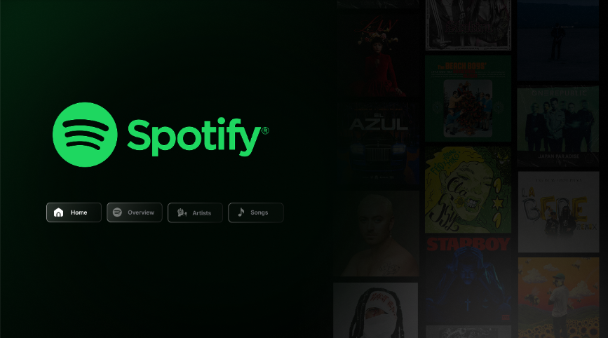
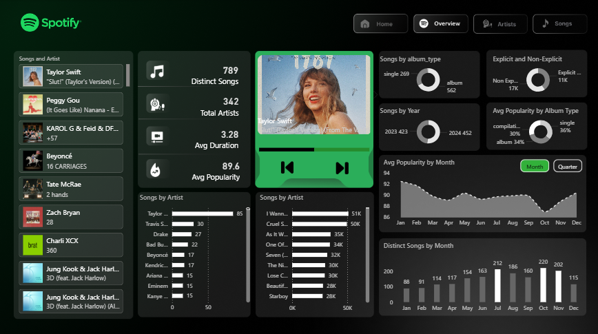
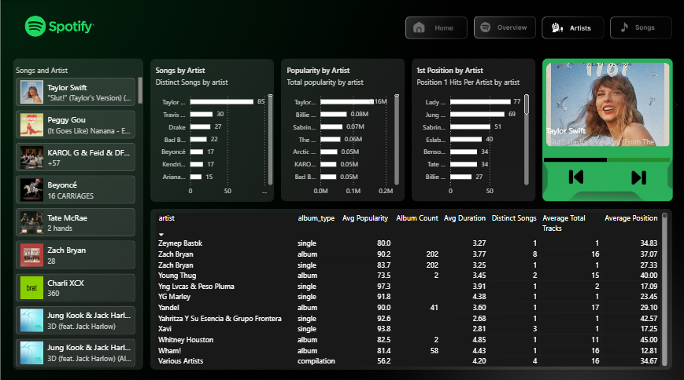
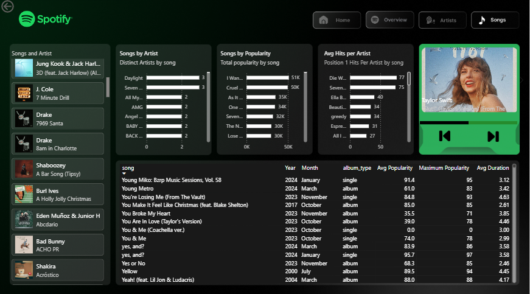

# Spotify Power BI Dashboard 🎵

An interactive and modern Spotify analytics dashboard built using Power BI.
This project demonstrates an end-to-end data analytics workflow, including data preparation, DAX measure creation, dashboard design, and interactive report development.

---

## 📌 Project Overview

This dashboard analyzes the **Top-50-World Spotify dataset** and provides insights into:

* Song popularity trends
* Artist performance
* Album statistics
* Monthly and quarterly analytics
* Interactive filtering and navigation

The project also integrates AI-assisted workflows using ChatGPT for generating DAX measures and identifying meaningful insights from the dataset.

---

## 🚀 Features

### 📊 Overview Dashboard

* KPI cards for important metrics
* Artist popularity analysis
* Song popularity analysis
* Average popularity trend by month
* Distinct songs analysis

### 🧠 AI-Assisted Analytics

* ChatGPT-generated DAX measures
* Insight generation using AI prompts
* Efficient bulk measure integration into Power BI

### 📅 Time Intelligence & Data Modeling

* Custom Month, Quarter, and Year columns
* Proper sorting using Month Index
* Dynamic date-based analysis

### 🔄 Interactive Features

* Dynamic slicers using Field Parameters
* Navigation buttons between pages
* Cross-page interaction
* Responsive filtering experience

### 🎵 Dedicated Pages

* Index Page
* Overview Page
* Artists Analysis Page
* Songs Analysis Page

---

## 🛠️ Tools & Technologies Used

* Power BI
* DAX
* Power Query
* ChatGPT
* GitHub

---

## 📂 Dataset

Dataset used:

* Top-50-World Spotify Dataset

The dataset contains:

* Song names
* Artist names
* Popularity scores
* Album information
* Release dates
* Duration and streaming-related attributes

---

## 📈 Key Learning Outcomes

Through this project, I learned:

* Advanced Power BI dashboard development
* DAX measure creation
* Data modeling and transformation
* Time intelligence techniques
* Interactive report design
* GitHub project management

---
## 📸 Dashboard Preview

### Index Dashboard


### Overview Dashboard


### Artist Dashboard


### Songs Dashboard


---

## 📁 Project Structure


```bash
Spotify Project/
│
├── assets/
│   ├── Backgrounds/
│   └── Icons/
│
├── Screenshots/
│
├── README.md
│
├── spotify-top-50-world.csv
│
└── Spotify-Top-50-world.pbix

---

## 🔗 Future Improvements

* Add real-time Spotify API integration
* Improve mobile responsiveness
* Add advanced predictive analytics
* Publish dashboard to Power BI Service

